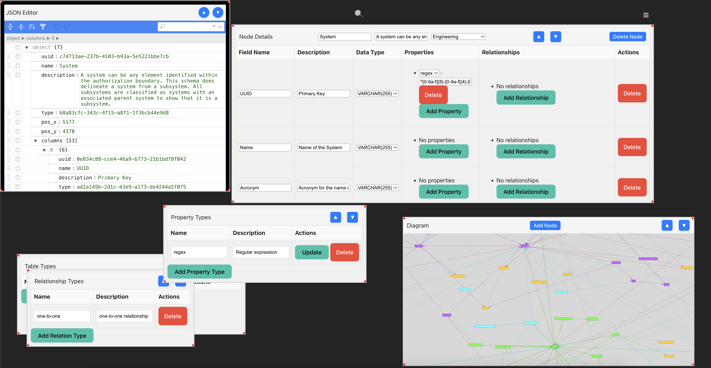

# Schema Editor





The Schema Editor is a web-based tool designed to facilitate the visualization, creation, and editing of JSON-based schemas. Developed by Stella Technologies, this editor is particularly tailored for working with the Cyber Data Schema but is versatile enough to handle various schema types. This project is structured as a full-stack application using Node.js and Vite for the frontend.

## Features

- **Create, View, and Edit JSON Schemas:** Interactive graphical interface to manipulate schema components.
- **Import and Export Schemas:** Supports importing schemas in a predefined JSON format and exporting the modified schema.
- **Customizable Interface:** Easily toggle different views and features through the UI.
- **Developed for Cyber Data Schema:** Optimized for specific schema standards available on [Cyber Data Schema GitHub](https://github.com/stellatechnologies/CyberDataSchema).

## Installation

Before installing, ensure you have [Node.js](https://nodejs.org/) installed on your system. This project uses Vite as a build tool and Concurrently to run multiple scripts.

1. Clone the repository:
   ```bash
   git clone git@github.com:stellatechnologies/DataSchemaEditor.git
   cd schema-editor
   ```

2. Install dependencies:
   ```bash
   npm install
   ```

## Usage

To run the project locally:

1. Start the backend and frontend concurrently:
   ```bash
   npm start
   ```

This will launch the backend server on `http://localhost:3000` and the frontend on `http://localhost:5173`.

## Scripts

- `npm run dev`: Runs the Vite server in development mode.
- `npm run build`: Builds the application for production.
- `npm run preview`: Preview the production build locally.
- `npm run start-backend`: Starts the backend server using Node.js.
- `npm run start-frontend`: Starts the frontend development server.

## Contributing

Contributions are welcome! For major changes, please open an issue first to discuss what you would like to change.

## License

This project is open-sourced under the GNU General Public License v3.0. See the [LICENSE](LICENSE) file for more details.

## About Stella Technologies

Stella Technologies specializes in technological innovations and software solutions. For more information or to inquire about custom features and enterprise solutions, visit [StellaTechnologies.space](https://stellatechnologies.space).
